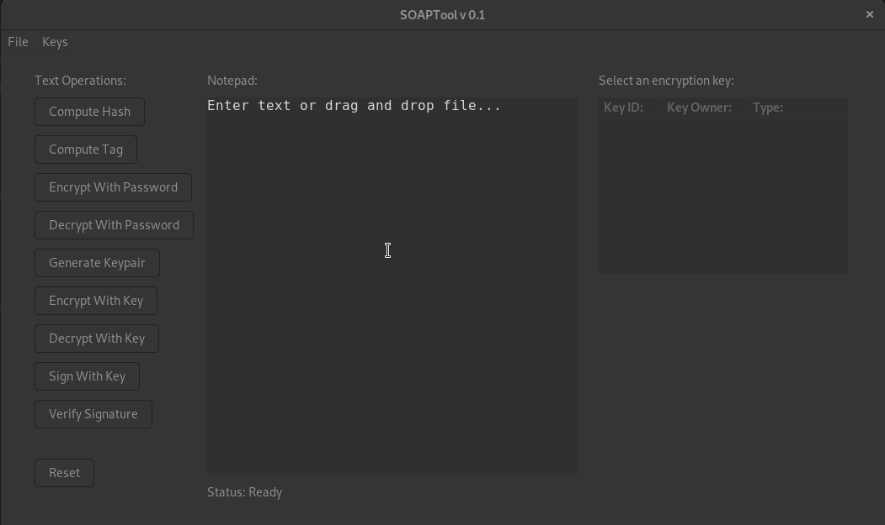
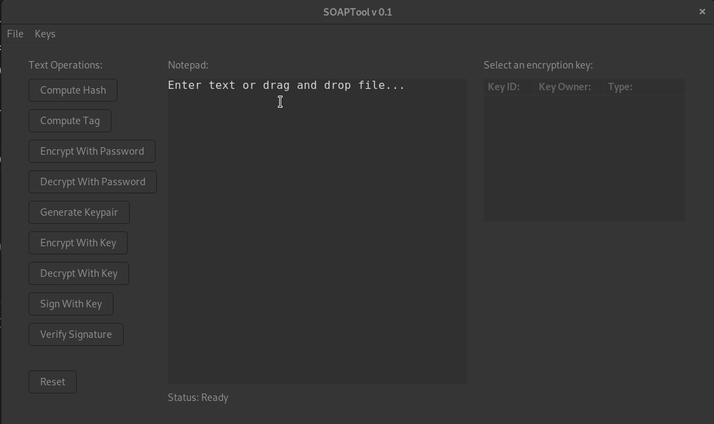
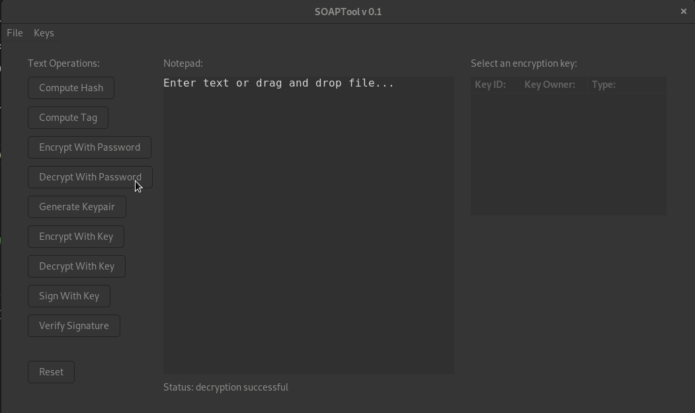
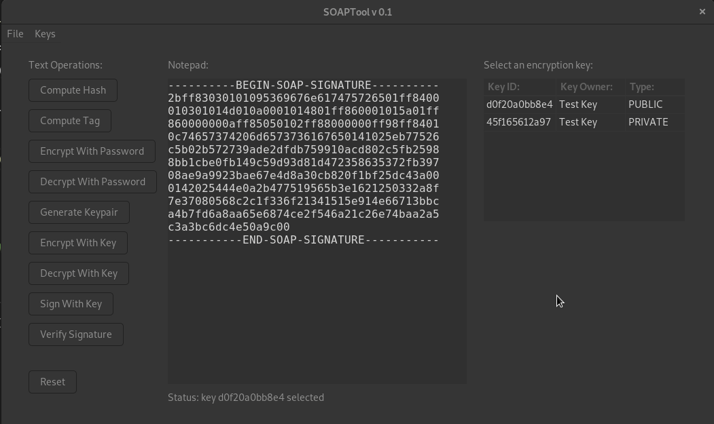

# SOAPy-Tool
## A complete desktop cryptosystem

The Super Optimal Amazing Privacy tool is a cryptosystem constructed from the SHA3 primitive paired with the Edwards 521 elliptic curve. The tool standardizes a message format to allow for easy exchange of data. A wide variety of operations are supported, inclduing message digest computation, authenticated encryption, and signature verification, both symmetrically and asymmetrically. 

Computing a cryptographic hash:

Encrypting and decrypting symmetrically under passphrase pw:

Generating a (Schnorr/ECDHIES) key pair from passphrase pw:

Verifying a signature under (Schnorr/ECDHIES) public key:

The backend of this application is constructed in Go. Support for parallel file processing is fully implemented but not yet connected to cryptographic operations. Work is underway to port this backend to Rust with the goal of measuring performance. The front end is GTK3.
